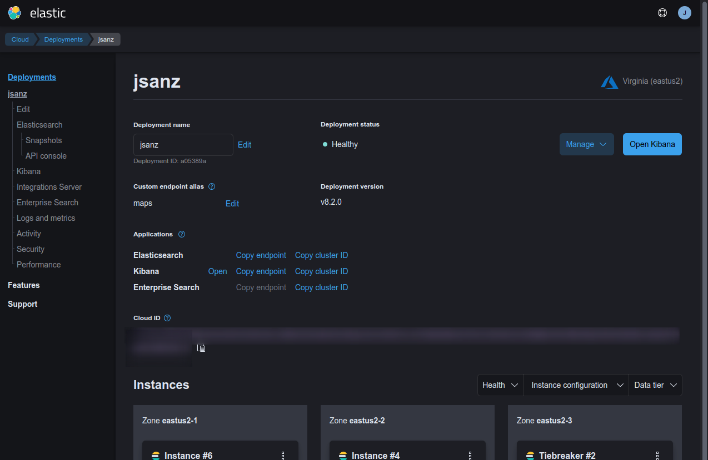
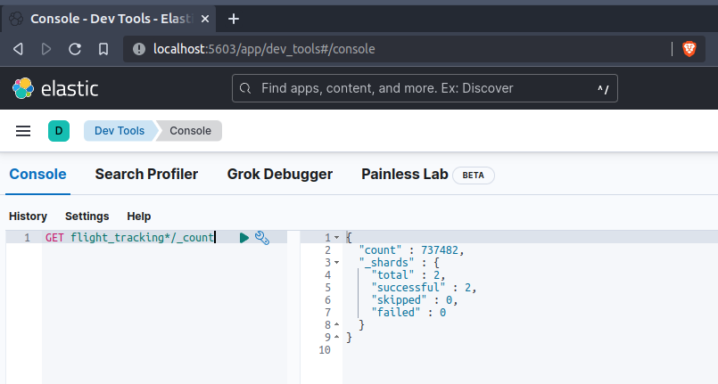

# Laboratory

## Elastic Stack set up

There are two recommended ways to set up the Elastic Stack for this laboratory:

* Create a trial account with the [Elastic Cloud][1]
* Use Docker Composer to start the stack locally

### Set up: Elastic Stack with [Elastic Cloud][1]

This is the easiest way to start this lab, simply create a new account at the [Elastic Cloud][1] and start a deployment. You can leave the default settings. Once you have the cluster up and running you need to save three important settings: 

* Cloud ID
* Username and password will be available to download as CSV: **do it**.

From the deployment page you can also get your endpoint URLs for Kibana and Elastic.



You have a full guide on how to set up the trial on the [Elastic Cloud Getting Started][2] page.

### Set up: Docker Compose

On the `/lab` folder you have a `docker-compose.yaml` file with the definition of all the services for this lab. It refers to a number of variables stored in the `.env` file. You may want to adapt this file but by default it should be fine.

First time you run it will take some minutes since it needs to download all the images, so maybe you'll want to run `docker compose pull` and `docker compose build` from a location with good bandwidth **before** the workshop to ensure you have all the docker images installed.

To start the Elastic Stack services you can run `docker compose up -d es01 es02 kibana`. This command will start two nodes of Elasticsearch and a Kibana instance.

Once running you can check their status with `docker compose ps` and `docker compose logs -f`.

If everything goes as expected you can visit kibana from `http://localhost:5601`.

## Getting [Open Sky][3] data into Elastic

Apart from having access to a Elastic Stack (both Elasticsearch and Kibana), you need data to explore them so we are going to load flights data in real time from the [Open Sky Network][3] using a simple nodejs script at the `opensky-loader` folder. Depending on how you access the stack the script should be adapted minimally. The script can also be run in two different ways, if you have a Node development environment then you can run it locally, but if you don't have it you can use Docker Compose also to run this script.

### Configuration

The file `lab/elastic-config.js` is configured with some settings:

* Elasticsearch client configuration
* Name of the index for your data
* How often you want to retrieve the data from OpenSky API (every 60 seconds is more than fine)

You only need to adapt the Elasticsearch configuration, that will differs depending if you are running in Elastic Cloud, Docker Compose, or Local.

The default is configured for the `docker compose` set up and will look like this:

```js
const fs = require('fs');

module.exports = {
    es_config: {
        node: 'https://es01:9200',
        auth: {
            username: 'elastic',
            password: 'changeme'
        },
        tls: {
          ca: fs.readFileSync('/usr/share/app/certs/ca/ca.crt'),
          rejectUnauthorized: true
        }
    },
    index_name: 'flight_tracking',
    sleep_seconds: 60
};
```

To run the script from **Cloud**:

```js
module.exports = {
    es_config: {
        cloud:{
            id: 'yor_very_long_cloud_id'
        },
        auth: {
            username: 'elastic',
            password: 'your_elastic_password'
          }
    },
    index_name: 'flight_tracking',
    sleep_seconds: 60
};
```


### Running the script

If you have docker compose, independently of how you are running the rest of the stack, you can run the script with:

```sh
$ docker compose start opensky-loader
```

If you prefer to run the script directly you just need to go to the `opensky-loader` folder and run:

```sh
$ npm install && npm start
```

**Note**: to run the script locally you need to have `node` and `npm` tools installed in your computer.

### Confirmation

The easiest way to check if your data is coming is going to the Kibana DevTools application and run this query

```
GET /flight_tracking*/_count
```

```
{
  "count" : 737482,
  "_shards" : {
    "total" : 1,
    "successful" : 1,
    "skipped" : 0,
    "failed" : 0
  }
}
```



[1]: https://www.elastic.co/cloud/elasticsearch-service/signup
[2]: https://www.elastic.co/guide/en/cloud/current/ec-getting-started.html
[3]: https://opensky-network.org/