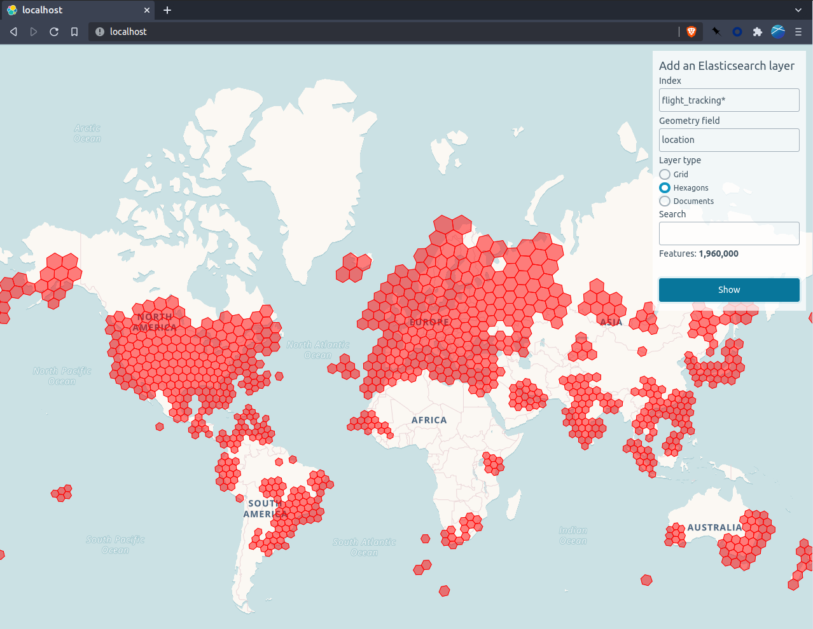

# Laboratory

## Elastic Stack set up

There are two recommended ways to set up the Elastic Stack for this laboratory:

* Create a trial account with the [Elastic Cloud][1]. This is the easiest and **recommended** procedure.
* Use [Docker](https://docs.docker.com/get-started/overview/) and [Composer](https://docs.docker.com/compose/) to start the stack locally

### Set up: Elastic Stack with [Elastic Cloud][1]

This is the easiest way to start this lab, simply create a new account at the [Elastic Cloud][1] and start a deployment. You can leave the default settings. Once you have the cluster up and running you need to save three important settings: 

* Cloud ID
* Username and password will be available to download as CSV: **do it**.

From the deployment page you can also get your endpoint URLs for Kibana and Elastic.


You have a full guide on how to set up the trial on the [Elastic Cloud Getting Started][2] page.

### Set up: Docker Compose

On the `/lab` folder you have a `docker-compose.yaml` file with the definition of all the services for this lab. It refers to a number of variables stored in the `.env` file. You may want to adapt this file but by default it should be fine.

| ⚠ Warning ⚠ |
| :-- |
| You should always set up a strong password for `elastic` and `kibana_system` users if your environment is exposed to the internet. Do not leave the defaults if your cluster is accessible to others! |

First time you run it will take some minutes since it needs to download all the images, so maybe you'll want to run `docker compose pull` and `docker compose build` from a location with good bandwidth **before** the workshop to ensure you have all the docker images installed.

To start the Elastic Stack services you can run `docker compose up -d es01 es02 kibana`. This command will start two nodes of Elasticsearch and a Kibana instance.

Once running you can check their status with `docker compose ps` and `docker compose logs -f`.

If everything goes as expected you can visit kibana from `http://localhost:5601`.

## Getting [Open Sky][3] data into Elastic

Apart from having access to a Elastic Stack (both Elasticsearch and Kibana), you need data to explore them so we are going to load flights data in real time from the [Open Sky Network][3] using a simple nodejs script at the `opensky-loader` folder. Depending on how you access the stack the environment needs to be adapted minimally. The script can also be run in two different ways, if you have a Node development environment then you can run it locally, but if you don't have it you can use Docker Compose also to run this script.

The file `lab/elastic-config.js` is configured with some default settings, a couple of them can be overridden by environment variables.

* Elasticsearch client configuration (host and password can be set up with environment variables).
* Prefix for the name of indexes that will store the flights positions. 
* How often you want to retrieve the data from OpenSky API (every 60 seconds is more than fine)

You only need to adapt the Elasticsearch configuration, that will differs depending if you are running in Elastic Cloud, Docker Compose, or Local.

### Running the OpenSky loader and viewer applications

### Running the Elastic stack with Docker Compose

If you use docker compose to run the full stack you can start the applications with:

```
docker compose up
```

#### Using Docker Compose and Elastic Cloud

If you are using Elastic Cloud and docker compose you need to set up in the `.env` file the following variables:

* `ELASTIC_HOST` is the Elasticsearch endpoint. You can get this URL from Elastic cloud management UI.
* `ELASTIC_PASSWORD` is the password for the `elastic` user and you should have this stored when you created your cluster.

Now you can run just the OpenSky loader and viewer using this command:

```
docker compose -f docker-compose-opensky.yml up
```

This will start the two services defined in the [alternate compose YAML file](../lab/docker-compose-opensky.yml) pointing to your cloud instance.

#### Running locally

| 🗣 Note 🗣 |
| :-- |
| To run the script locally you need to have `node` and `npm` tools installed in your computer.|

If you prefer to run the applications directly on your computer you just need on separate terminals to go to the `opensky-loader` and `opensky-viewer` folders and run:

```sh
$ export ELASTIC_HOST="https://your-elasticsearch-endpoint:9643"
$ export ELASTIC_PASSWORD="your_elastic_user_password"
$ npm install
$ npm start
```


### Confirmation

The easiest way to check if your data is being ingested is going to the Kibana DevTools application and run this query

```
GET /flight_tracking*/_count
```

```
{
  "count" : 737482,
  "_shards" : {
    "total" : 1,
    "successful" : 1,
    "skipped" : 0,
    "failed" : 0
  }
}
```


Also, your OpenSky viewer application should render data from the `flight_tracking*` index pattern.



[1]: https://www.elastic.co/cloud/elasticsearch-service/signup
[2]: https://www.elastic.co/guide/en/cloud/current/ec-getting-started.html
[3]: https://opensky-network.org/
